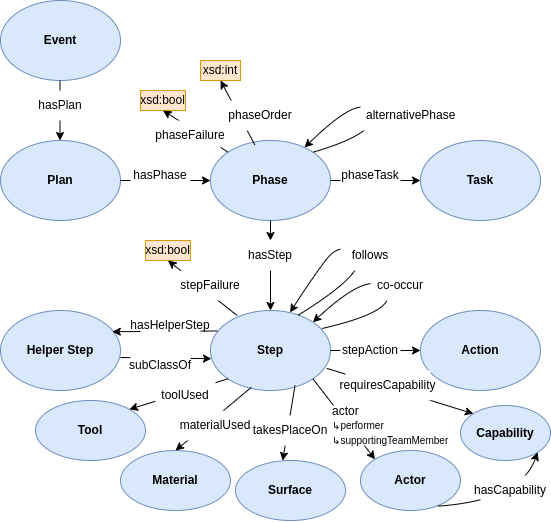

# Twin_OR
Ontology engineering for the digital twin of the operating room (robotic arm use-case). This project includes creating an ontology for a hybrid intelligence project where a trained surgeon and a robotic arm perform a medical procedure in collaboration. It provides mechanisms for integrating real-time sensor data with ontology-driven reasoning and validation using SHACL.

## Ontology Structure
The core ontology describes various components of the operating room, in particular, a hierarchical structure of the medical procedure. This design safeguards the process, allowing the robotic arm to offer support through helper steps or to default to alternative plans when necessary during a medical procedure. The "Step" class is the lowest hierarchical component of the procedure, encapsulating relevant information that is pertinent at the time.

The structure of the ontology includes classes, properties, and rules that govern the relationship between entities, ensuring consistency and logical correctness. A visual representation of the ontology can be seen below:



## Demo
To see an example ontology use navigate to the Demo folder and execute the
run.py file.

### **Requirements**

Before running the demo, ensure you have the following installed:

- **Python** (version 3.6 or higher)
- **Required Python Libraries**:
  - `rdflib`
  - `pyshacl`
  - `owlready2`
  
You can install the required libraries using pip:

```bash
pip install rdflib pyshacl owlready2
